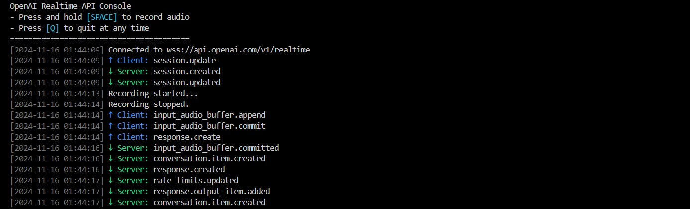

# OpenAI Realtime API Console
A simple command-line-based python console for testing and interacting with the OpenAI Realtime API, inspired by the official [OpenAI Realtime Console](https://github.com/openai/openai-realtime-console) app.



## Features
- Push-to-talk audio recording
- Audio playback
- An async Python client for the OpenAI Realtime API


## Installation
1. Clone the repository:
   ```bash
   git clone https://github.com/S4mpl3r/openai-realtime-console-py.git
   cd openai-realtime-console-py
   ```

2. Create a virtual environment and activate it. 
   
   Windows:
   ```bash
   python -m venv .venv
   .venv\Scripts\activate
   ```
   MacOS/Linux:
   ```bash
   python3 -m venv .venv
   source .venv/bin/activate
   ```


3. Install dependencies:

   Windows:
   ```bash
   python -m pip install -r requirements.txt
   ```
   MacOS/Linux:
   ```bash
   python3 -m pip install -r requirements.txt
   ```


4. Create a `.env` file and add your OpenAI API key:
   ```bash
   OPENAI_API_KEY="your-api-key"
   ```

5. Run the console:

   Windows:
   ```bash
   python console.py
   ```
   MacOS/Linux:
   ```bash
   python3 console.py
   ```

6. Press and hold the `space` bar to talk, release to stop. Press `q` to quit.

## License
This project is licensed under the [MIT License](LICENSE).

## Resources
- [OpenAI Realtime API](https://platform.openai.com/docs/guides/realtime)
- [OpenAI Realtime Console React](https://github.com/openai/openai-realtime-console)
